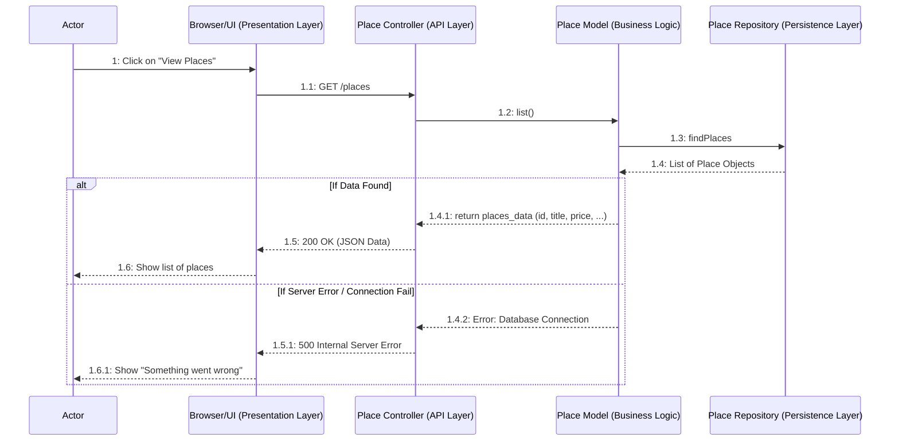

```mermaid
sequenceDiagram
    participant A as Actor
    participant UI as Browser/UI (Presentation Layer)
    participant C as Place Controller (API Layer)
    participant M as Place Model (Business Logic)
    participant R as Place Repository (Persistence Layer)

    A->>UI: 1: Click on "View Places"
    UI->>C: 1.1: GET /places
    C->>M: 1.2: list()
    M->>R: 1.3: findPlaces
    R-->>M: 1.4: List of Place Objects

    alt If Data Found
        M-->>C: 1.4.1: return places_data (id, title, price, ...)
        C-->>UI: 1.5: 200 OK (JSON Data)
        UI-->>A: 1.6: Show list of places
    else If Server Error / Connection Fail
        M-->>C: 1.4.2: Error: Database Connection
        C-->>UI: 1.5.1: 500 Internal Server Error
        UI-->>A: 1.6.1: Show "Something went wrong"
    end
```
