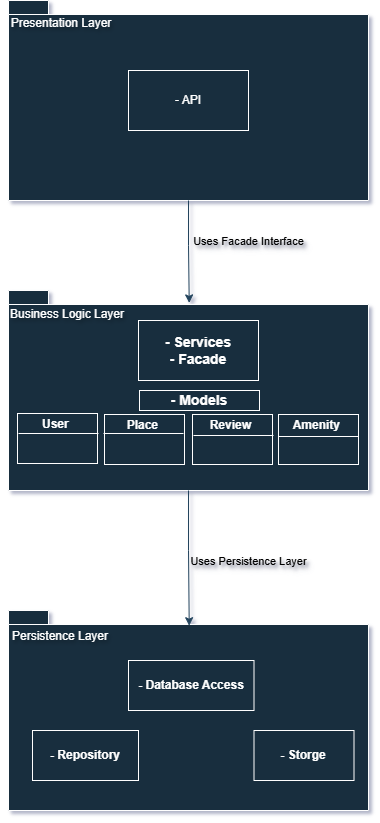
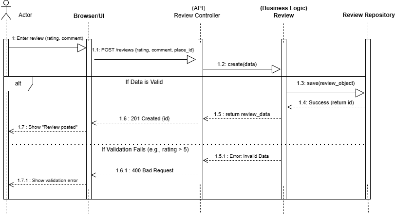

# HBnB Evolution: Technical Design Document (Part 1)

**Project:** HBnB (Holberton AirBnB Clone)  
**Date:** February 7, 2026  
**Status:** Architecture & Design Phase  

---

## 1. Introduction

### 1.1 Purpose
This document serves as the comprehensive technical blueprint for **Part 1** of the HBnB evolution. It details the architectural decisions, modular design, and data flow required to build a robust backend system. The document is intended to guide the implementation of the API, Business Logic, and Persistence layers.

### 1.2 Scope
This document covers:
* **High-Level Architecture:** The layered structure and the Facade pattern.
* **Business Logic Layer:** The domain model entities and their relationships.
* **API Interaction Flows:** Detailed sequence diagrams for critical operations, including Authentication, Place Management, and Review Submission.

---

## 2. High-Level Architecture

### 2.1 Architecture Overview
The system follows a **Layered Architecture** to ensure separation of concerns. This modularity allows for easier maintenance, testing, and scalability. The **Facade Pattern** is central to this design, providing a simplified interface for the API to interact with complex business logic.

### 2.2 Package Diagram

*(Note: Ensure this link points to your actual Package Diagram file)*

### 2.3 Explanatory Notes
* **Presentation Layer (Services):** The entry point for external clients (Web, Mobile). It handles HTTP requests, input sanitization, and basic authentication. It communicates *only* with the Business Logic Facade.
    
* **Business Logic Layer (Facade & Models):** Contains the core intelligence of the application. 
    * **The Facade (`HBnBFacade`):** Acts as a gatekeeper. It orchestrates workflows (e.g., "Create a Place") by validating data and interacting with the Repository.
    * **Domain Models:** Python classes (User, Place, Review) that hold data and business rules.

* **Persistence Layer (Repositories):** Abstracts the data storage. Whether the data is in memory, a file, or a SQL database, the Business Logic layer doesn't need to know. It simply calls methods.

---

## 3. Business Logic Layer

### 3.1 Domain Model Overview
The domain model represents the core entities of the AirBnB clone.

### 3.2 Detailed Class Diagram

*(Note: Ensure this link points to your actual Class Diagram file)*

### 3.3 Explanatory Notes
* **User:** Represents a registered user. Holds credentials and personal info.
* **Place:** Represents a rental property. It is linked to a `User` (owner) via `owner_id`.
* **Review:** Represents feedback left by a `User` for a `Place`. It links to both entities.
* **Amenity:** Represents features (Wi-Fi, AC) linked to a Place.
* **HBnBFacade:** The central control class. It implements the Singleton pattern (or simple instance management) to handle logical operations like `create_user()`, `get_place()`, and `create_review()`.

---

## 4. API Interaction Flows

This section details the dynamic behavior of the system.

### 4.1 User Registration (`POST /auth/register`)
**Goal:** Register a new user in the system.

**Flow Description:**
1.  **API:** Receives user data (email, password, etc.).
2.  **Facade:** Checks if the email already exists in the Repository.
3.  **Validation:** If the email exists, raise an error (400 Bad Request).
4.  **Action:** If valid, create a new `User` object and save it to the Repository.
5.  **Response:** Return the new User ID (201 Created).

---

### 4.2 Place Creation (`POST /places`)
**Goal:** Allow a registered user to list a new property.

**Flow Description:**
1.  **API:** Receives place details and the `user_id` (from the authenticated token/session).
2.  **Facade:** Validates the input (e.g., Price > 0, Title is not empty).
3.  **Action:** Instantiates a `Place` object linked to the `user_id`.
4.  **Persistence:** Saves the object to the Repository.
5.  **Response:** Returns the new Place ID (201 Created).

---

### 4.3 List All Places (`GET /places`)
**Goal:** Retrieve a list of all available properties.

**Flow Description:**
1.  **API:** Receives a request to fetch places.
2.  **Facade:** Calls `get_all_places()` method.
3.  **Persistence:** The Repository fetches all stored Place objects.
4.  **Processing:** The Facade returns the list of objects to the API.
5.  **Response:** The API serializes the objects to JSON and returns them (200 OK).

---

### 4.4 Submit Review (`POST /reviews`)
**Goal:** Allow a user to post a review for a specific place.

**Flow Description:**
1.  **API:** Receives `place_id`, `user_id`, `rating`, and `comment`.
2.  **Facade:** Performs critical validation:
    * Does the `user_id` exist?
    * Does the `place_id` exist?
    * Is the `rating` between 1 and 5?
3.  **Validation Error:** If any check fails, return an error (400 Bad Request).
4.  **Action:** Create a `Review` object linking the User and the Place.
5.  **Persistence:** Save the review to the Repository.
6.  **Response:** Return the new Review ID (201 Created).

---

## 5. Conclusion
This architecture ensures that the HBnB application is **modular** and **testable**. By forcing all API interactions through the **Facade**, we centralize business rules and validation, preventing invalid data from corrupting the persistence layer. The separation of the Repository layer allows us to start with in-memory/file storage now and easily switch to a SQL database in Part 2 without rewriting the core logic.
