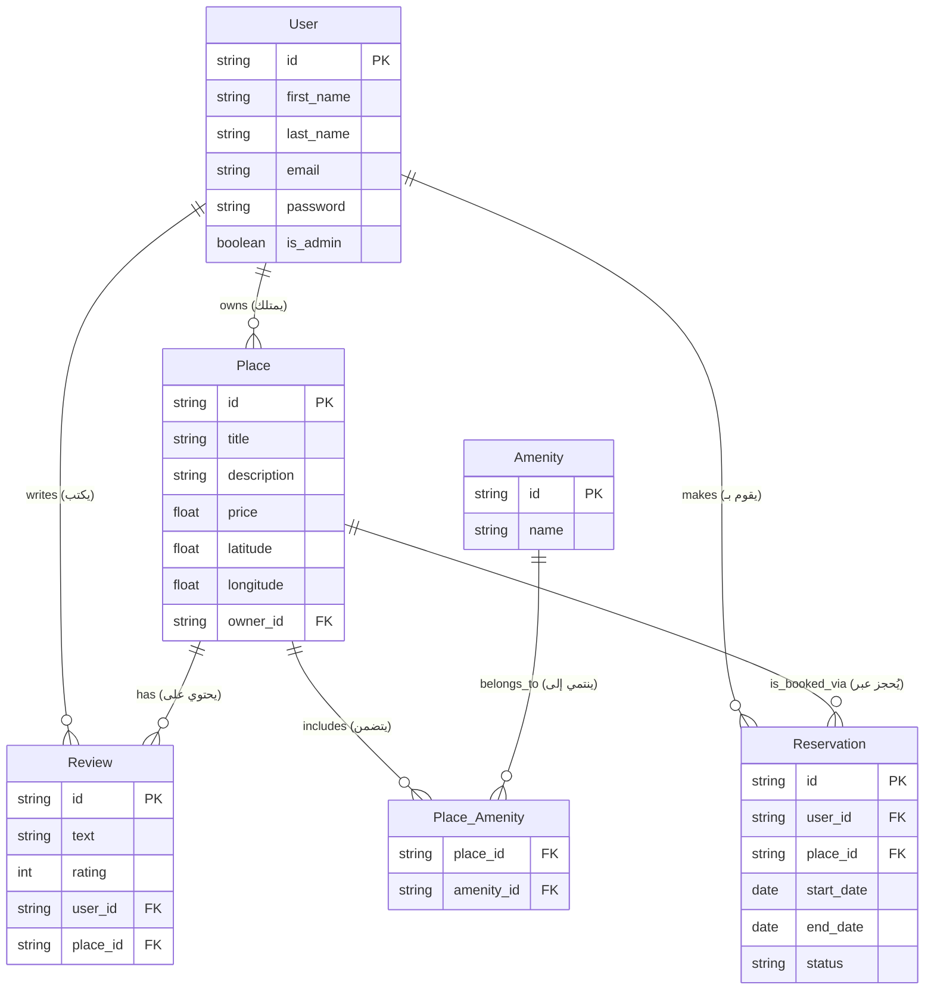

# Tasks-0: Application Factory & Configuration

In this task, the project structure was updated to follow the **Application Factory Pattern** for better scalability and environment management.

## Key Changes

| Feature                   | Description                                                                                                                             |
| ------------------------- | --------------------------------------------------------------------------------------------------------------------------------------- |
| **Dynamic Configuration** | Updated the `create_app()` function in `app/__init__.py` to accept a `config_class` parameter                                           |
| **Config Loading**        | Integrated `app.config.from_object(config_class)` to automatically load settings (like `DEBUG`, `SECRET_KEY`) from the `config.py` file |
| **Default Behavior**      | Set `config.DevelopmentConfig` as the default setting to ensure the app runs in development mode by default                             |
| **Clean Startup**         | Refactored `run.py` to use the factory instance, removing the need to manually pass `debug=True`                                        |

---

## Tasks-1: User Password Hashing

### Overview

Added secure password hashing to enhance API security using industry-standard practices.

### Implementation Details

- **Bcrypt Integration**: Added secure password hashing using `flask-bcrypt`
- **User Model**: Updated to include:
  - `hash_password` method
  - `verify_password` method
- **API Security**:
  - Modified `POST /api/v1/users/` to accept passwords
  - Passwords are strictly excluded from all `GET` responses via the serialization layer

### Code Example

```
python
# User model password methods
class User(BaseModel):
    def hash_password(self, password):
        self.password = bcrypt.generate_password_hash(password).decode('utf-8')

    def verify_password(self, password):
        return bcrypt.check_password_hash(self.password, password)
```

## Task 2: Implement JWT Authentication

### Objective

Implemented a secure JWT-based authentication system for the HBnB application, allowing users to log in and access protected resources using tokens.

### Changes Performed

| Step  | Component                         | Description                                                                                                                                                                                                                                                              |
| ----- | --------------------------------- | ------------------------------------------------------------------------------------------------------------------------------------------------------------------------------------------------------------------------------------------------------------------------ |
| **1** | **Configuration & Dependencies**  |                                                                                                                                                                                                                                                                          |
|       | `requirements.txt`                | Added `flask-jwt-extended` and `flask-bcrypt` to handle token management and password hashing                                                                                                                                                                            |
|       | `app/__init__.py`                 | Initialized JWTManager and Bcrypt within the application factory (`create_app`) and registered the new authentication namespace                                                                                                                                          |
| **2** | **User Security & Model Updates** |                                                                                                                                                                                                                                                                          |
|       | `app/models/user.py`              | Integrated bcrypt to securely hash passwords during user creation and implemented the `verify_password` method to validate credentials during login                                                                                                                      |
| **3** | **Authentication API**            |                                                                                                                                                                                                                                                                          |
|       | `app/api/v1/auth.py`              | Created a new `/login` endpoint that validates user credentials via the Facade and issues a JWT Access Token containing the user's ID and admin status (`is_admin`) as claims                                                                                            |
| **4** | **Service Layer (Facade)**        |                                                                                                                                                                                                                                                                          |
|       | `app/services/facade.py`          | Verified and utilized the `get_user_by_email` method to allow the authentication system to retrieve users from the repository based on their email addresses                                                                                                             |
| **5** | **API Protection (Middleware)**   |                                                                                                                                                                                                                                                                          |
|       | `app/api/v1/places.py`            | Applied the `@jwt_required()` decorator to sensitive endpoints (POST, PUT) to ensure only authenticated users can create or modify listings. Implemented `get_jwt_identity()` to automatically link new places to the authenticated user's ID, enhancing system security |

**Diagram Title:** The Magical Project ER 🌳

**Description:**  
Imagine the project as a magical tree. Each `entity` is a leaf on this tree, and the branches show how they are connected. The diagram shows **how entities relate to each other** using familiar symbols:

**Shapes and Symbols in the Diagram:**

- **Rectangle (`Entity`)**: Represents a main object or data type, like `User` or `Product`.
- **Diamond (`Relationship`)**: Represents a connection between entities, like "writes" or "enrolls in".
- **Oval (`Attribute`)**: Shows details about an entity, like `name`, `email`, or `price`.
- **Lines with symbols**: Show the type of relationship:
  - **`1---*`** : One-to-Many. A single branch supports many leaves. Example: one `User` can write many `Posts`.
  - **`*---*`** : Many-to-Many. Two branches share many leaves. Example: `Students` and `Courses` can link to many of each other.

## Task 3: Implementation of Authenticated User Access

### Objective

Secured specific API endpoints to ensure data integrity and enforce business rules regarding resource ownership.

### Key Logic Implemented

| Feature                  | Description                                                                                                                          |
| ------------------------ | ------------------------------------------------------------------------------------------------------------------------------------ |
| **Ownership Validation** |                                                                                                                                      |
|                          | Users can only update/delete Places they created                                                                                     |
|                          | Users can only update/delete Reviews they authored                                                                                   |
|                          | Users can only modify their own User Profiles                                                                                        |
| **Review Restrictions**  |                                                                                                                                      |
|                          | Implemented logic to prevent users from reviewing their own places                                                                   |
|                          | Restricted users to a maximum of one review per place to ensure authentic feedback                                                   |
| **Profile Integrity**    |                                                                                                                                      |
|                          | Explicitly blocked updates to email and password fields within the profile update endpoint to prevent unauthorized account hijacking |
| **Public Accessibility** |                                                                                                                                      |
|                          | Ensured that GET requests for places and reviews remain open to the public without requiring a JWT token                             |

This ER diagram gives you a **magical, visual view** of how data flows and relates in the project.


