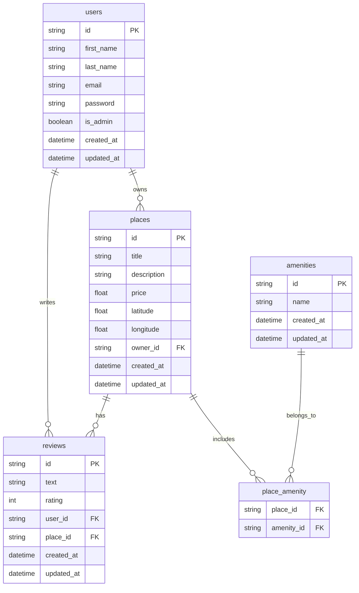

## HBnB - Part 3 (Enhanced Backend: Auth + Persistence)

This `part3/` directory is the **backend slice** of the HBnB project. It extends earlier parts by adding:

- **configuration via application factory**
- **password hashing (bcrypt)**
- **JWT authentication and authorization**
- **persistent storage** via SQLAlchemy + SQLite (development)
- **database relationships** (1:N and N:M)
- **raw SQL scripts** (schema + seed + CRUD checks)
- **tests** that validate ORM + SQL + HTTP behavior

This README is written task-by-task (Tasks 0 → 10) to match the Holberton Part 3 requirements. The official instructions reference repository is `https://github.com/Holberton-Uy/hbnb-doc/tree/main/part3`.

## Project structure

```text
part3/
├── app/
│   ├── __init__.py                  # Flask app factory and namespace registration
│   ├── extensions.py                # db, bcrypt, jwt extension instances
│   ├── api/v1/
│   │   ├── auth.py                  # login endpoint (JWT token issuing)
│   │   ├── users.py                 # users CRUD and profile authorization rules
│   │   ├── places.py                # places CRUD + ownership enforcement
│   │   ├── reviews.py               # reviews CRUD + business rules
│   │   └── amenities.py             # amenities CRUD (admin controlled writes)
│   ├── models/
│   │   ├── base_model.py            # shared id/timestamps + save/delete/update helpers
│   │   ├── user.py
│   │   ├── place.py
│   │   ├── review.py
│   │   └── amenity.py
│   ├── persistence/repository.py    # abstract + SQLAlchemy repository base
│   └── services/
│       ├── facade.py                # use-case orchestration
│       └── repositories/            # model-specific repositories
├── sql/
│   ├── create_tables.sql            # full relational schema
│   ├── seed_data.sql                # admin + default amenities
│   └── crud_checks.sql              # SQL-level CRUD verification
├── tests/
│   └── test_relationships.py        # ORM relationship tests
├── config.py                        # environment configuration
├── run.py                           # app entrypoint
├── seed_admin.py                    # helper admin seeding (app-level)
├── requirements.txt
└── test.sh                          # unified verification script
```

## Architecture overview

### 1) Presentation layer

`app/api/v1/*` exposes REST endpoints through Flask-RESTX namespaces.

Key behavior:

- open read endpoints where required
- protected write endpoints using `@jwt_required()`
- ownership checks for updates/deletes
- admin-only operations for privileged resources

### 2) Business layer

`app/services/facade.py` centralizes business rules and orchestrates:

- validation before persistence
- entity lookups and cross-entity checks
- creation/update logic independent from route handlers

### 3) Persistence layer

`app/persistence/repository.py` defines repository interfaces and SQLAlchemy implementation.
Model repositories in `app/services/repositories/` provide typed access.

## Data model and relationships

Entities:

- `User`
- `Place`
- `Review`
- `Amenity`

Relationships:

- one-to-many:
  - `User.places` <-> `Place.owner`
  - `User.reviews` <-> `Review.user`
  - `Place.reviews` <-> `Review.place`
- many-to-many:
  - `Place.amenities` <-> `Amenity.places` through `place_amenity`

Data integrity rules include:

- unique user email
- rating range constraint (1..5)
- foreign keys between related entities
- one review per user/place pair in raw SQL schema

## Authentication and authorization

- Login endpoint (`/api/v1/auth/login`) issues JWT access tokens.
- Passwords are stored hashed (bcrypt), never plain text.
- JWT identity is used to enforce ownership rules for places/reviews/users.
- Admin claim (`is_admin`) is used for privileged actions (for example, amenity creation/update).

## SQL scripts

The `sql/` directory contains standalone database scripts for evaluator checks:

- `create_tables.sql`: creates all required tables and relationships
- `seed_data.sql`: inserts required admin and initial amenities
- `crud_checks.sql`: tests SQL-level insert/select/update/delete flows

### Seeded admin user

- fixed id: `00000000-0000-0000-0000-000000000001`
- email: `admin@hbnb.io`
- password: bcrypt hash of `admin1234`
- `is_admin = TRUE`

## Setup

```bash
pip install -r requirements.txt
python run.py
```

## Tests

Run all tests with one command:

```bash
bash test.sh
```

### What `test.sh` validates

`test.sh` is now a full project smoke + integrity runner and checks everything in sequence:

1. **ORM relationship unit tests**
   - runs `python -m unittest discover -s tests -v`
   - verifies `user.places`, `place.reviews`, and `place.amenities` / `amenity.places`
2. **Raw SQL schema checks**
   - executes `sql/create_tables.sql`, `sql/seed_data.sql`, `sql/crud_checks.sql`
   - validates FK/PK constraints and CRUD behavior
   - confirms admin password is bcrypt-hashed and required amenities are seeded
3. **API and auth smoke tests**
   - creates an in-memory app DB
   - logs in as admin and gets JWT
   - creates amenity, users, place, and review through real API endpoints
   - verifies retrieval endpoints return linked amenities/reviews correctly

If all phases pass, the script ends with:

`All checks passed (unit + SQL + API)`

## API summary

Base namespace: `/api/v1`

- `/auth/login`
- `/users` and `/users/<user_id>`
- `/places`, `/places/<place_id>`, `/places/<place_id>/reviews`
- `/reviews` and `/reviews/<review_id>`
- `/amenities` and `/amenities/<amenity_id>`

This gives a complete backend slice for authenticated resource management with persistent relational storage.

## Task-by-task implementation guide (0 → 10)

### Task 0 — Application factory + configuration

- **Goal**: keep app creation configurable and scalable.
- **Where**: `app/__init__.py`, `config.py`
- **What to look for**:
  - `create_app(config_class=...)`
  - `app.config.from_object(config_class)`

### Task 1 — Password hashing (bcrypt)

- **Goal**: never store plaintext passwords.
- **Where**: `app/models/user.py`, `app/services/facade.py`, `app/api/v1/users.py`
- **Key idea**:
  - hash during creation
  - do not serialize password in GET responses

### Task 2 — JWT authentication (`flask-jwt-extended`)

- **Goal**: stateless login with access tokens.
- **Where**: `app/api/v1/auth.py`, `app/extensions.py`, `app/__init__.py`
- **What happens**:
  - client POSTs email/password
  - server verifies hashed password
  - server returns `access_token`

### Task 3 — Authenticated user access + ownership checks

- **Goal**: only the owner can modify their resources (unless admin).
- **Where**: `app/api/v1/places.py`, `app/api/v1/reviews.py`, `app/api/v1/users.py`
- **Examples**:
  - user can only update/delete their own place
  - user can’t review their own place
  - user can’t review the same place twice

### Task 4 — Administrator access endpoints

- **Goal**: admins can manage global resources and bypass ownership restrictions.
- **Where**: `app/api/v1/users.py`, `app/api/v1/amenities.py`
- **Mechanism**: JWT claim `is_admin` is embedded at login and checked on protected endpoints.

### Task 5 — SQLAlchemy repository pattern

- **Goal**: persistence logic should not live inside API routes.
- **Where**: `app/persistence/repository.py`, `app/services/repositories/*.py`
- **What this gives you**:
  - consistent CRUD API for models
  - ability to swap persistence strategies without rewriting business logic

### Task 6 — Map `User` entity to SQLAlchemy

- **Goal**: store users in DB with constraints (unique email) and timestamps.
- **Where**: `app/models/base_model.py`, `app/models/user.py`

### Task 7 — Map `Place`, `Review`, `Amenity` entities

- **Goal**: store core entities in DB with correct types/constraints.
- **Where**: `app/models/place.py`, `app/models/review.py`, `app/models/amenity.py`

### Task 8 — Map relationships between entities

- **Goal**: enable `user.places`, `place.reviews`, `place.amenities`, `amenity.places`.
- **Where**:
  - 1:N via `owner_id`, `user_id`, `place_id` foreign keys
  - N:M via association table `place_amenity` in `app/models/place.py`

### Task 9 — SQL scripts (schema + seed)

- **Goal**: prove you can design the schema without ORM.
- **Where**: `sql/create_tables.sql`, `sql/seed_data.sql`, `sql/crud_checks.sql`
- **Seed requirements**:
  - admin user fixed UUID id
  - bcrypt-hashed password
  - initial amenities inserted

### Task 10 — ER diagram (Mermaid.js)

The diagram below matches the schema and relationships.

